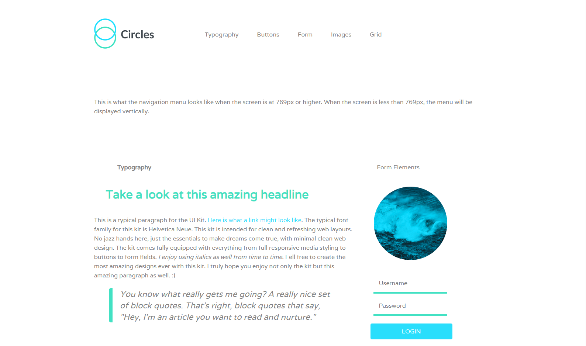
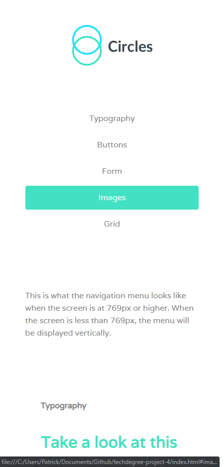

# Web Style Guide
This was the project #4 of the [Treehouse Front End Web Development Techdegree](https://teamtreehouse.com/techdegree/front-end-web-development-2).  
I really enjoyed doing this project! During the development of this project I learned a lot about how awesome Sass is when it comes to modularizing css to make things less of a mess. Even with my small scale projects, I found my css file can get larger very quickly. And sass is here to solve the problem!  
Reinventing the wheel of a basic grid system gave me so much insight on how to use the more complicated grid systems in frameworks such as bootstrap, though native CSS grid is making it's way here. (IE why you no full support)

## Instruction From Treehouse
> In this project, we’ve provided an index.html file with a set of class names already defined. You will be responsible for creating rules to style the web page using each of those class names. This will provide you with a set of classes that you can then use in other projects to apply similar styles. You'll create a sass project to do this, using partials, variables, extends, and mixins to apply the styles and classes to the style guide page. When done, you’ll have a Sass micro-framework to quickly prototype other websites.

## Starter Content From Treehouse
- index.html (Strictly told not to modify)
- no_classes.html (same markup structure but without any classes)
- 3 .png files used on the site
- mockup images for desktop and mobile
- mockup images for no_classes.html

## Deliverable
- A responsive, mobile-first design web style guide with a simple grid system.

## Technology focus
Most important aspects of Sass were introduced in this chapter. I implemented and practiced the following features of Sass in this project:
- Variables
- mixins
- functions
- extends
- imports
- ...last but not least, the folder structure and the concept of modularizing scss into smaller and more managable components.

## Screenshots

Desktop

    

Mobile

    

